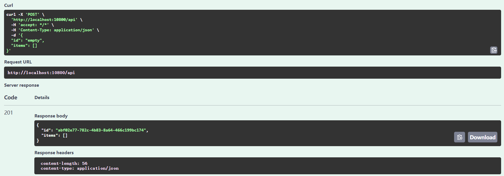
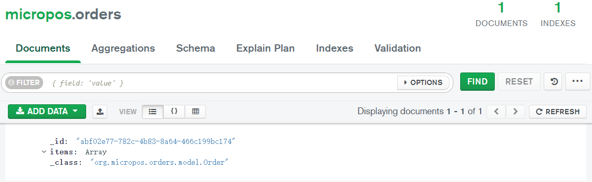
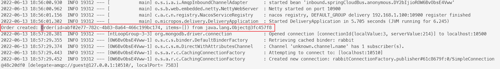
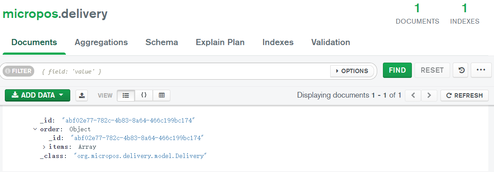
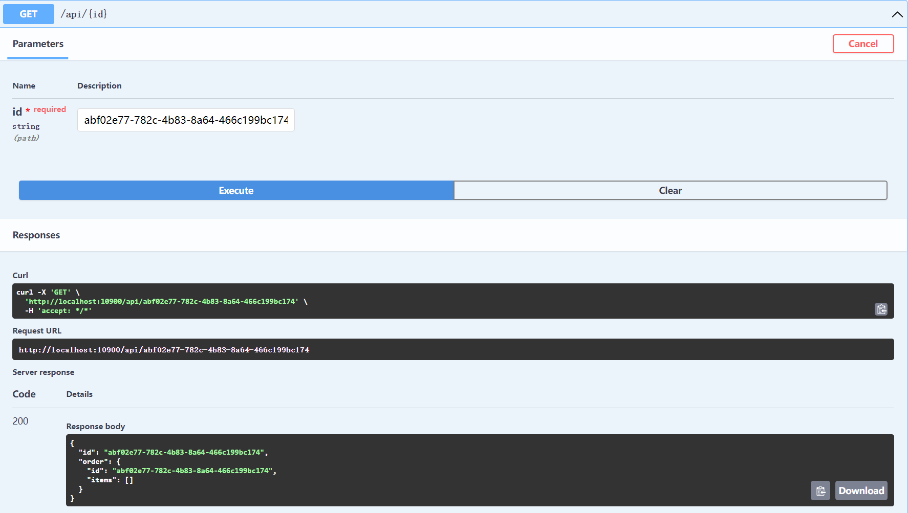
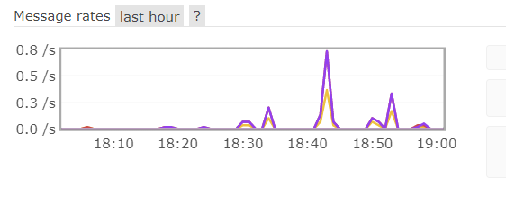
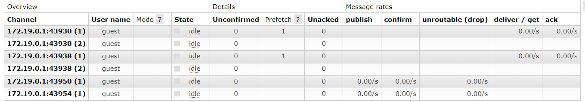

# aw07

> 此仓库版本为适用于此次作业的快照版本，原项目参见 [micro-pos](https://github.com/StardustDL/micro-pos)

1. 添加了订单服务和配送服务，完善了购物车服务
2. 订单服务和购物车服务在创建和更新数据时使用 OpenFeign 调用商品服务，检查并保证数据一致性
3. 基于 Spring Cloud Bus 和 Spring Cloud Stream，使用容器化 RabbitMQ 作为消息队列，实现订单服务和配送服务的消息传递
    1. 订单服务检查无误，创建订单时，首先写入数据库，然后在消息总线上向配送服务发送 `OrderCreated` 事件
    2. Spring Cloud Bus 将此事件发送到消息队列中
    3. 配送服务监听消息队列，接收并解析发送给自己的 `OrderCreated` 事件

核心实现代码如下：

```java
// 订单服务
public Mono<Order> create(OrderRequest item) {
    return Flux.fromIterable(item.getItems())
            .filter(x -> x.getQuantity() > 0)
            .map(x -> new Item(productService.get(x.getProductId()), x.getQuantity()))
            .filter(x -> x.getProduct() != null)
            .collectList()
            .map(x -> new Order(item.getId(), x))
            .flatMap(x -> repository.create(x))
            .map(x -> {
                context.publishEvent(new OrderCreatedEvent(x, this, applicationName, "delivery"));
                return x;
            });
}

// 配送服务
@Component
public class OrderReceiver implements ApplicationListener<OrderCreatedEvent> {
    @Autowired
    private DeliveryRepository repository;

    @Override
    public void onApplicationEvent(OrderCreatedEvent event) {
        System.out.println("Order created: " + event.getOrder() + " from " + event.getSource());
        repository.create(new Delivery(event.getOrder().getId(), event.getOrder())).block();
    }
}
```

## 效果展示

创建订单



订单数据库更新



配送服务接收到消息



创建新配送任务，更新配送数据库



配送服务开放配送状态查询 RESTful API



RabbitMQ 状态统计




## Description

Please extend your MicroPOS system by adding a delivery service shown as the following figure.


When an order is placed by a user, the order serivce sends out an event into some AMQP MOM (such as RabbitMQ). The delivery service will be notified and a new delivery entry will be generated automatically. User can query the delivery status for his orders.

Use [Spring Cloud Stream](https://spring.io/projects/spring-cloud-stream) to make the scenerio happen. Of coz you can refer to the [demo](https://github.com/sa-spring/stream-loan) for technical details.